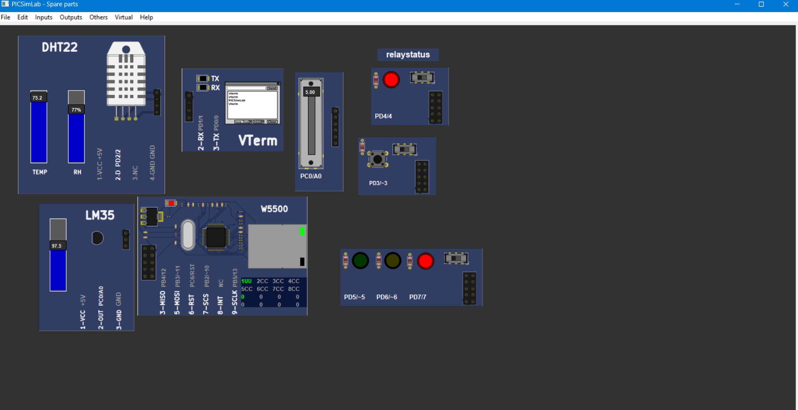
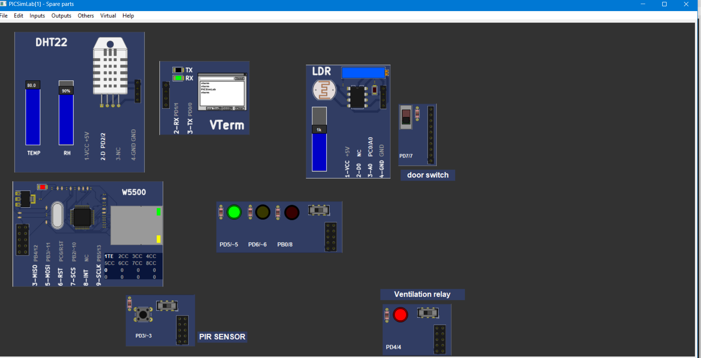
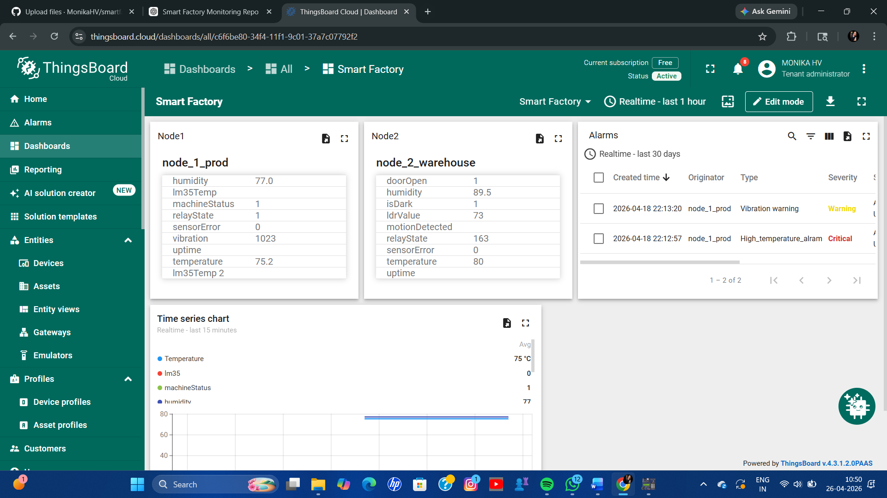

# smartfactorymonitoringsystem
An IoT-based smart factory monitoring system for real-time industrial safety, machine monitoring, and energy management.
# Smart Factory Monitoring System

An IoT-based smart factory monitoring system for real-time industrial safety, machine monitoring, and energy management.

## Project Overview
This project monitors factory conditions such as temperature, humidity, gas leakage, and machine status using IoT sensors and ESP32 nodes. The collected data is sent to the cloud for real-time monitoring and analysis.

## Features
- Real-time sensor monitoring
- Machine status tracking
- Cloud dashboard integration
- Alert generation
- Remote monitoring

## Components Used
- ESP32 / NodeMCU
- Temperature Sensor
- Gas Sensor
- Current Sensor
- ThingsBoard Cloud
- Wi-Fi Module

## Project Structure
- `node1_ino` – Sensor node 1 code
- `node2_ino` – Sensor node 2 code
- `SensorManager.cpp` – Sensor data handling
- `network.cpp` – Network communication
- `telemetry.cpp` – Cloud telemetry
- `actuator.cpp` – Actuator control

## Output

## Applications
- Smart factories
- Industrial automation
- Worker safety
- Predictive maintenance
